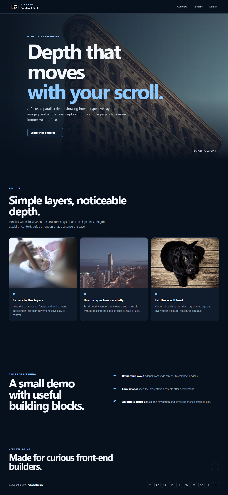

# Parallax Effect

A responsive HTML, CSS and JavaScript demo that uses perspective, layered images and scroll position to create a lightweight parallax experience.

## Features

- Perspective-based parallax hero section
- Responsive layout with mobile navigation
- Locally stored image assets
- Accessible navigation and icon-only social links
- Dynamic copyright year and back-to-top control

## Tech Stack

- HTML5
- CSS3 and Sass source
- Vanilla JavaScript

## Run locally

Open \`index.html\` in a browser, or serve the folder with a local static server.

## Deployment

Live demo: [a2rp.github.io/parallax_effect_html_css](https://a2rp.github.io/parallax_effect_html_css/)

## Links

- Portfolio: [ashishranjan.net](https://www.ashishranjan.net/)
- GitHub: [github.com/a2rp](https://github.com/a2rp)
- CodePen: [codepen.io/ash1198](https://codepen.io/ash1198)
- LinkedIn: [linkedin.com/in/aashishranjan](https://www.linkedin.com/in/aashishranjan)
- Facebook: [facebook.com/theash.ashish](https://www.facebook.com/theash.ashish/)
- YouTube: [youtube.com/@ashishranjan-ashz](https://www.youtube.com/@ashishranjan-ashz?sub_confirmation=1)
- Email: [ash.ranjan09@gmail.com](mailto:ash.ranjan09@gmail.com)

## Support

- Support: [a2rp-donation-page.netlify.app](https://a2rp-donation-page.netlify.app/)
- Buy Me a Coffee: [buymeacoffee.com/a2rp](https://buymeacoffee.com/a2rp)
- Patreon: [patreon.com/a2rp](https://www.patreon.com/a2rp)